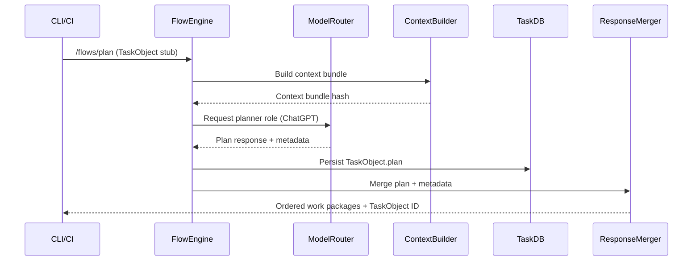

# Delivery A Architecture — Flow Sequence

```mermaid
sequenceDiagram
    participant CLI as CLI/CI
    participant FE as FlowEngine
    participant MR as ModelRouter
    participant CB as ContextBuilder
    participant DB as TaskDB
    participant RM as ResponseMerger

    CLI->>FE: /flows/plan (TaskObject stub)
    FE->>CB: Build context bundle
    CB-->>FE: Context bundle hash
    FE->>MR: Request planner role (ChatGPT)
    MR-->>FE: Plan response + metadata
    FE->>DB: Persist TaskObject.plan
    FE->>RM: Merge plan + metadata
    RM-->>CLI: Ordered work packages + TaskObject ID
```

> Similar sequences exist for `impl`, `review`, `docs`, each referencing role-specific models and ResponseMerger behavior.
