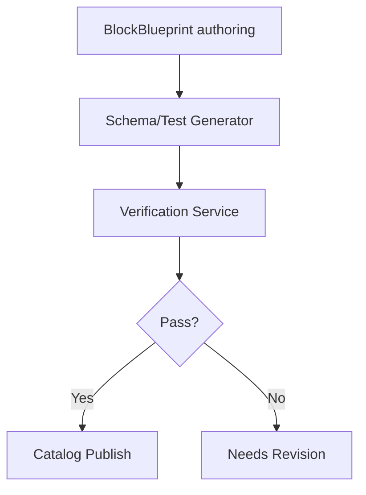

# Delivery B Architecture — Verified Blocks Components

- **Block Authoring:**
  - Engineers define `BlockBlueprint` (six faces) stored in Blueprint store.
- **Contract Generation:**
  - Schema generator produces JSON Schemas for left/right faces.
  - Test generator emits unit/property tests from schemas + AC.
- **Verification Service:**
  - Runs unit/integration/property/mutation suites.
  - Captures mutation kill-rate, links results to block version.
- **Catalog:**
  - Publishes `block_id@version` with references: blueprint, contracts, verification report, owners, tags.

