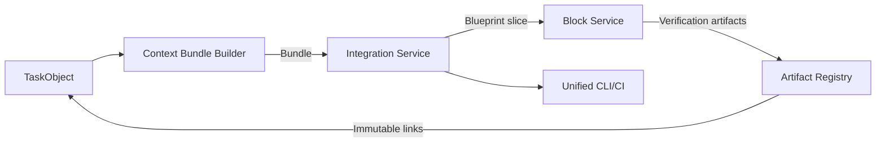

# Delivery C Architecture — Platform Integration

**Key Concepts**
- Integration Service maps Flow outputs (TaskObject) to block artifacts via context bundles.
- Artifact registry keeps SRS drafts, reviews, test reports with hash-based links, enabling replayable runs.
- CLI/CI uses Integration Service to drive end-to-end Basel-I commands.
